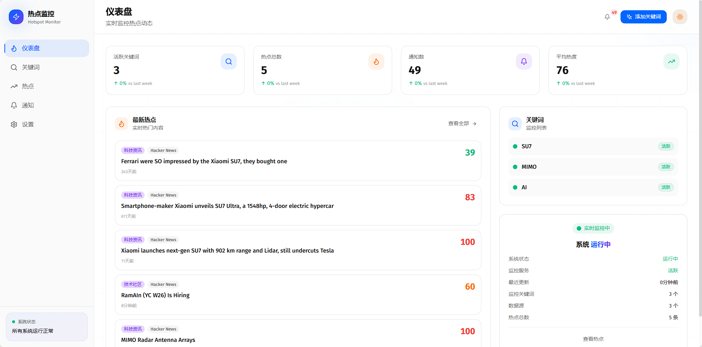
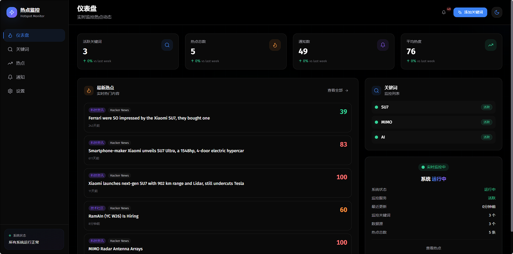

# 热点监控工具

自动发现和监控热点信息，支持AI智能摘要和多数据源聚合的智能工具。

## 功能特性

### 核心功能
- 🔍 **关键词监控** - 自定义关键词，实时监控多个数据源
- 📊 **热点发现** - 自动抓取多个平台的热点数据
- 🤖 **AI 摘要** - 点击生成热点内容的智能摘要（200字以上）
- 📝 **打字机效果** - AI摘要以打字机动画效果展示
- 📈 **热度评分** - 基于多维度数据计算热度分数
- 🌐 **多语言支持** - 支持中文/英文多语言界面
- 📱 **响应式设计** - 适配不同设备屏幕
- 🎨 **现代 UI** - Dark Mode + Glassmorphism 设计风格
- ♾️ **无限滚动** - 热点列表支持无限滚动加载

### 数据源支持
- **微博热搜** - 实时微博热门话题
- **知乎热榜** - 知乎热门问题
- **百度热点** - 百度搜索实时热点
- **Hacker News** - 技术社区热门话题
- **DuckDuckGo** - 搜索引擎热点
- **RSS 源** - 可自定义添加RSS订阅
- **Web Scraper** - 通用网页抓取

## 界面预览

### 仪表盘首页（浅色模式）


### 仪表盘首页（深色模式）


## 技术栈

- **前端**: Next.js 14 + React + TypeScript + Tailwind CSS
- **后端**: Next.js API Routes + Prisma ORM
- **数据库**: SQLite (可切换 PostgreSQL/MySQL)
- **AI**: OpenRouter / OpenAI / Anthropic API 支持
- **数据抓取**: axios + node-html-parser + cheerio
- **状态管理**: Zustand + React Query
- **图表**: Recharts
- **国际化**: next-intl

## 快速开始

### 1. 安装依赖
```bash
npm install
```

### 2. 配置环境变量
复制 `.env.example` 到 `.env` 并填写必要的配置：

```env
# 数据库
DATABASE_URL="file:./dev.db"

# JWT密钥 (生产环境必须使用强密钥)
JWT_SECRET="your-super-secret-jwt-key-change-this-in-production"

# AI服务 (至少配置一个)
OPENROUTER_API_KEY="your-openrouter-api-key"
# 或
OPENAI_API_KEY="your-openai-api-key"
# 或
ANTHROPIC_API_KEY="your-anthropic-api-key"
```

### 3. 初始化数据库
```bash
npx prisma db push
```

### 4. 启动开发服务器
```bash
npm run dev
```

访问 http://localhost:3000 查看应用。

## 项目结构

```
hotspot-monitoring-tool/
├── prisma/                 # 数据库模型
│   └── schema.prisma
├── src/
│   ├── app/               # Next.js App Router
│   │   ├── api/           # API 路由
│   │   │   ├── keywords/  # 关键词管理API
│   │   │   ├── hotspots/  # 热点管理API
│   │   │   ├── monitor/   # 监控服务API
│   │   │   └── settings/  # 系统设置API
│   │   ├── dashboard/     # 仪表盘页面
│   │   ├── hotspots/      # 热点列表/详情页面
│   │   ├── keywords/      # 关键词管理页面
│   │   ├── monitor/       # 监控中心页面
│   │   └── settings/      # 设置页面
│   ├── components/        # React 组件
│   │   ├── layout/        # 布局组件
│   │   ├── ui/            # UI 组件
│   │   └── charts/        # 图表组件
│   ├── lib/               # 核心库
│   │   ├── ai.ts          # AI 服务
│   │   ├── sources/       # 数据源管理
│   │   │   ├── base.ts    # 基础数据源抽象类
│   │   │   ├── weibo.ts   # 微博数据源
│   │   │   ├── zhihu.ts   # 知乎数据源
│   │   │   ├── baidu.ts   # 百度数据源
│   │   │   ├── hackernews.ts
│   │   │   ├── duckduckgo.ts
│   │   │   └── manager.ts # 数据源管理器
│   │   ├── monitor.ts     # 监控服务
│   │   ├── api.ts         # API 客户端
│   │   └── prisma.ts      # 数据库连接
│   └── hooks/             # 自定义 Hooks
├── messages/              # 国际化文件
├── scripts/               # 工具脚本
└── docs/                  # 文档
```

## API 接口

### 关键词管理
- `GET /api/keywords` - 获取关键词列表
- `POST /api/keywords` - 创建关键词
- `DELETE /api/keywords/:id` - 删除关键词

### 热点管理
- `GET /api/hotspots` - 获取热点列表 (支持分页、筛选、排序)
- `GET /api/hotspots/:id` - 获取热点详情
- `POST /api/hotspots/:id/summary` - 生成AI摘要

### 监控服务
- `GET /api/monitor/status` - 获取监控状态
- `POST /api/monitor/fetch` - 立即执行数据获取
- `GET /api/monitor/logs` - 获取监控日志

### 系统设置
- `GET /api/settings` - 获取系统设置
- `POST /api/settings` - 更新系统设置

## 数据源架构

### 基础数据源类
所有数据源都继承自 `BaseDataSource` 抽象类：

```typescript
abstract class BaseDataSource {
  abstract readonly name: string;        // 数据源名称
  abstract readonly type: string;        // 数据源类型
  abstract readonly defaultWeight: number;    // 默认权重
  abstract readonly defaultMinScore: number;  // 默认最小分数
  
  abstract fetch(keywords?: string[]): Promise<SourceHotspot[]>;
}
```

### 数据源配置
数据源在 `manager.ts` 中统一管理，支持：
- 动态启用/禁用
- 权重配置
- 最小分数阈值
- 健康状态监控

## AI 摘要功能

### 使用方式
1. 进入热点详情页面
2. 点击"生成AI摘要"按钮
3. 摘要以打字机效果逐字显示

### 配置要求
需要在 `.env` 中配置AI服务：
```env
AI_API_KEY="your-api-key"
AI_BASE_URL="https://api.openrouter.ai/api/v1"
AI_MODEL="openai/gpt-4o-mini"
```

### 摘要特点
- 最少200字详细摘要
- 基于标题和内容生成
- 自动缓存避免重复生成

## 页面说明

### 仪表盘 (/dashboard)
- 实时数据统计
- 热点趋势图表
- 来源分布图表
- 最近热点列表
- 活跃关键词列表

### 热点列表 (/hotspots)
- 无限滚动加载
- 多维度筛选（来源、时间、热度、验证状态）
- 多种排序方式
- 搜索功能
- 分享卡片

### 热点详情 (/hotspots/:id)
- 完整内容展示
- AI摘要生成
- 热度趋势图
- 收藏功能
- 分享功能

### 关键词管理 (/keywords)
- 添加/删除关键词
- 启用/停用关键词
- 分类管理

### 监控中心 (/monitor)
- 数据源健康状态
- 实时日志查看
- 手动触发数据获取

## 开发计划

### 已完成 ✅
- [x] 仪表盘首页 - 实时状态监控和数据统计
- [x] 热点列表 - 无限滚动、筛选、排序
- [x] 热点详情 - AI摘要、打字机效果
- [x] 关键词管理 - CRUD操作
- [x] 多数据源支持 - 微博、知乎、百度、HackerNews等
- [x] 数据可视化 - 热度趋势、来源分布图表
- [x] 暗黑模式 - 深色主题支持
- [x] 响应式设计 - 移动端适配
- [x] 国际化支持 - 中文/英文
- [x] 用户认证系统 - JWT认证

### 待开发 📋
- [ ] 邮件通知功能
- [ ] Web Push 通知
- [ ] Twitter API 数据源
- [ ] Reddit 数据源

## 环境变量说明

| 变量名 | 说明 | 必需 |
|--------|------|------|
| DATABASE_URL | 数据库连接URL | 是 |
| JWT_SECRET | JWT签名密钥 | 是 |
| AI_API_KEY | AI服务API密钥 | 否 |
| AI_BASE_URL | AI服务基础URL | 否 |
| AI_MODEL | AI模型名称 | 否 |
| OPENROUTER_API_KEY | OpenRouter API密钥 | 否 |
| OPENAI_API_KEY | OpenAI API密钥 | 否 |
| ANTHROPIC_API_KEY | Anthropic API密钥 | 否 |

## 贡献指南

欢迎提交 Issue 和 Pull Request！

1. Fork 本仓库
2. 创建特性分支 (`git checkout -b feature/amazing-feature`)
3. 提交更改 (`git commit -m 'Add some amazing feature'`)
4. 推送到分支 (`git push origin feature/amazing-feature`)
5. 打开 Pull Request

## 许可证

MIT
